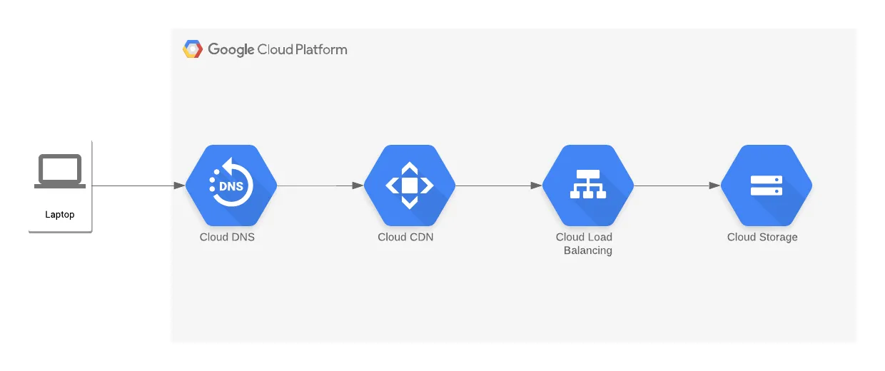

# Node Todo
A simple node app to test GCP stack deployments.

---
## Stack

### Static Front End
An example of this type of architecture can be found [here](https://medium.com/swlh/setup-a-static-website-cdn-with-terraform-on-gcp-23c6937382c6)

Using the React app in the examples folder of this repository, you may create a build and then push the static assets in /dist to the storage bucket to deploy the frontend.

### Service Accounts

### IAM Policies

### Network
A good network module can be found [here](https://registry.terraform.io/modules/terraform-google-modules/network/google/7.1.0?utm_content=documentLink&utm_medium=Visual+Studio+Code&utm_source=terraform-ls). This may be overkill for what we are trying to do but it's something to fall back on.

We can also use the default network to get started.

### Firewall Rules

### Load Balancing

### Backend API
We will be using Cloud Run to orchestrate and manage container clusters. 

[Cloud Run Official Docs](https://cloud.google.com/run/?utm_source=google&utm_medium=cpc&utm_campaign=na-US-all-en-dr-bkws-all-all-trial-e-dr-1605212&utm_content=text-ad-none-any-DEV_c-CRE_623126732147-ADGP_Desk%20%7C%20BKWS%20-%20EXA%20%7C%20Txt%20_%20General%20_%20Product%20Support-KWID_43700076167765433-kwd-678836618089&utm_term=KW_google%20cloud%20run-ST_google%20cloud%20run&gclid=CjwKCAjw44mlBhAQEiwAqP3eVonj8vzdwJkpF2l8mTzgTZidxnM9qrejcfSfL07M8sX-e3PTeuB4lhoCDzAQAvD_BwE&gclsrc=aw.ds)

[Cloud Run GCP Console](https://console.cloud.google.com/run?)

[Cloud Run Terraform Simple Example](https://github.com/GoogleCloudPlatform/terraform-google-cloud-run/tree/v0.8.0/examples/simple_cloud_run)

[Cloud Run Terraform Example with VPC](https://github.com/GoogleCloudPlatform/terraform-google-cloud-run/tree/v0.8.0/examples/cloud_run_vpc_connector)

[Cloud Run Simple Example Blog Post](https://ruanmartinelli.com/posts/terraform-cloud-run/)

> Questions:
> - What inputs does a Cloud Run module need in order to launch successfully? 
> - 

### In-memory Cache

### Database

---

## Deployments

Use GitHub Actions workflows to test, build and deploy code changes.

---

## Notes

### Authenticating Terraform Cloud with GCP

You will need a service account for the Terraform agent to interact with GCP. There are mulitple ways to perform this. Ideally, what you want to do is use Workload Identity Federation. We're going to do a classic service account with a credentials json for speed and simplicity. In the future we should replace this with WIF. It's really not that hard.

[Workload Identity Federation](https://cloud.google.com/iam/docs/workload-identity-federation?_ga=2.22965950.-466698892.1687471982&_gac=1.226558831.1688398950.CjwKCAjw44mlBhAQEiwAqP3eVkyCPeYDllbX9O1yShtr8uB5oh_sdsoL5To1vLJLi2U2VzzJ9A7fLxoClDMQAvD_BwE)

This is a dump of actions, not necessarily meant as instructions. It's more of a log of what I'm doing. It will need to be refined once everything is working and ideally repeated for verification.
- Create a Terraform Cloud workspace
- Create a GCP Service Account
- Create a `GCP_CREDENTIALS` variable in TF Cloud
- Copy the Service Account credentials json and set the value of the `GCP_CREDENTIALS` to the contents of the json.

> NOTE: there was a blog post i had open earlier that documented this as gcloud commands. This is the ideal method because it's much easier to document and source control than console navigation instructions. It sucks that I lost it because it was dope and it looked comprehensive.
- Create a `terraform` project for shared resources.
    - initially created the project on the root level with no organization
    - create a service account under the terraform project
    - copy the json to the 

<u>***NEXT STEPS:***</u>
- ***Create a demo project for testing.***
- ***Add roles to the servcie account***
- ***Set up CI for Terraform changes***

(Need to determine the registry solution. Are we using the GitHub Registry or the GCP registry. Seems like GCP is easier to authenticate. GitHub is better for hosting NPM packages.)
- ***Create a GitHub Action for building the api image with Docker***